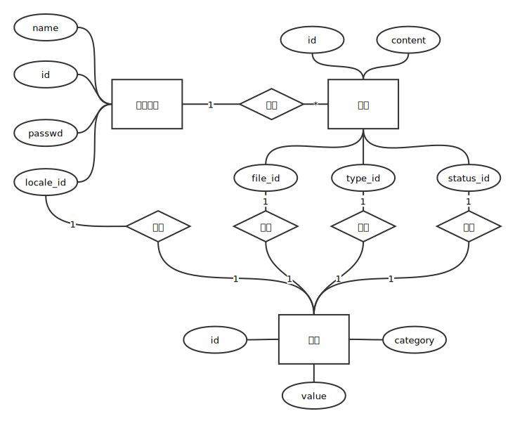

# E-R 关系图和表结构设计

### 需求说明
```
字典管理
  点击字典管理，可对字典数据进行新增和修改操作。
执法人员管理
  点击执法人员管理，可对执法人员信息进行新增和修改操作。
新闻政策
  新闻政策菜单包括一个新闻政策的二级菜单。
  点击新闻政策菜单，显示区域显示已发布的新闻政策，包括新闻标题，新闻类型，文件类型，新闻状态等信息。同时显示区域上方可对新闻政策信息进行过滤查询，并有发布新闻，启用或禁用某条新闻，修改新闻和预览新闻等按钮。
    ①.新闻查询通过新闻标题对新闻进行过滤，筛选出符合条件的新闻。
    ②.点击发布新闻，可在线填写新闻标题，选择文件类型和新闻分类，并可在线编辑要发布的新闻或政策的内容。
    ③.点击启用/禁用，可改变单条新闻的状态，启用或禁用该条新闻。
    ④.选中新闻后，点击修改新闻，可对新闻标题，新闻类型和新闻内容进行更改。
    ⑤.点击新闻预览，可预览选中的新闻。
```

## 实体关系图


## 表项
### 1. 字典
#### 1.1 dict 字典表
| 字段名 | 字段类型 | 默认值 | 说明 |
|-------|--------|--------|-----|
|dict_id|INTEGER||字典 ID|
|dict_category|VARCHAR(100)||字典类型值|
|dict_value|VARCHAR(100)||字典内容|

**dict_category 为常量，值如下**
```
0(NEWS_TYPE)   => 新闻类型字典
1(NEWS_STATUS) => 新闻状态字典
2(FILE_TYPE)   => 文件类型字典
3(LOCALE)      => 地区字典
```

### 2. 执法人员表
#### 2.1 officer 表
| 字段名 | 字段类型 | 默认值 | 说明 |
|-------|--------|--------|-----|
|officer_id|INTEGER||执法人员 ID|
|officer_name|VARCHAR(50)||执法人员名字|
|officer_gender|VARCHAR(10)||执法人员性别|
|officer_major|VARCHAR(50)||执法人员专业|
|officer_job|VARCHAR(50)||执法人员职务|
|officer_license_id|VARCHAR(50)||执法人员许可编号|
|officer_locale_id|INTEGER||执法人员工作地区，外键|
|user_id|INTEGER||执法人员用户 ID（用于登录）|

### 3. 新闻政策表
#### 3.1 news 表
| 字段名 | 字段类型 | 默认值 | 说明 |
|-------|--------|--------|-----|
|news_policy_id|INTEGER||新闻政策 ID|
|news_title|VARCHAR(250)||新闻名称|
|news_content|TEXT||新闻内容|
|news_date|DATE||新闻日期|
|news_type_id|INTEGER||新闻类型 ID，外键|
|new_status_id|INTEGER||新闻状态 ID，外键|
|file_type_id|INTEGER||文件类型 ID，外键|
|publish_officer_id|INTEGER||发布的执法人员 ID，外键|


### 4. 访问控制
#### 4.1 tokens 表
| 字段名 | 字段类型 | 默认值 | 说明 |
|-------|--------|--------|-----|
|access_token|VARCHAR(100)||访问秘钥|
|user_id|INTEGER||创建者 ID，外键|

#### 4.2 users 表
| 字段名 | 字段类型 | 默认值 | 说明 |
|-------|--------|--------|-----|
|username|VARCHAR(100)||登录名|
|password|VARCHAR(100)||登录密码|
|role|INTEGER||用户角色|

**role 为常量，值如下**
```
0(ADMINISTRATOR) => 最高管理员
1(OFFICER)       => 执法人员
2(COMMON)        => 普通用户
3(DELETED)       => 已删除账户
```