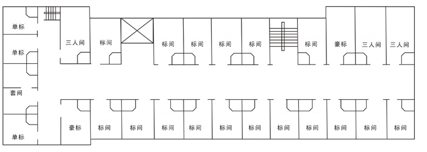

#酒店前台

在图中，已经被租出去的房间应显示为淡红色，表示当前不可出租，未被租出去的房间应涂成淡蓝色，表示马上可以入住。所有房子包括已出租或未出租均可查询。

已知宾馆共有5层，每层布局均相同，使用快捷键`F1`~`F5`键切换各层图片，使用鼠标点击模拟用户触摸屏幕，开始查询该房间情况，使用回车键表示开始住店，此时会弹出对话框，要求顾客填入姓名，欲住房号，求租时间。如果顾客按下确定键表示确定租房，此时应更新系统内各房数据。
